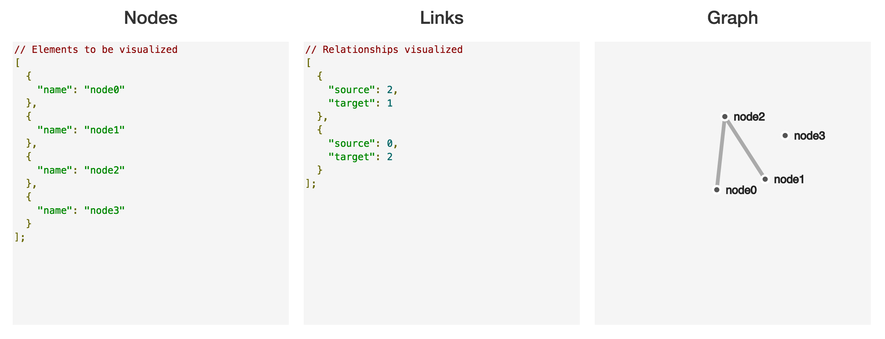

# Module 11: Networks (Force Directed Layouts)

## Overview
In this module, we'll look at D3's approach for building network visualizations. While there are many ways of visualizing networks ([adjacency matrices](https://bost.ocks.org/mike/miserables/), [hive plots](https://bost.ocks.org/mike/hive/), [dendrograms](https://bl.ocks.org/mbostock/4063570), etc.), this module focuses on methods for explicitly visualizing network graphs.

If you prefer watching entertaining videos to reading tutorials, I suggest you watch [this talk](https://www.youtube.com/watch?v=Mucmb33711A&list=PLlgxAbM67lYIQ5jid9cXsm72wEpHhAnyb&index=8) by [Jim Vallandingham](http://vallandingham.me/), which captures and explains these ideas incredibly well.
<!-- START doctoc generated TOC please keep comment here to allow auto update -->
<!-- DON'T EDIT THIS SECTION, INSTEAD RE-RUN doctoc TO UPDATE -->
**Contents**

- [Resources](#resources)
- [Network Data](#network-data)
- [High-level View](#high-level-view)

<!-- END doctoc generated TOC please keep comment here to allow auto update -->

## Resources
Here are a few resources to help you better understand network graphs:

- [Abusing the Force](https://www.youtube.com/watch?v=Mucmb33711A&list=PLlgxAbM67lYIQ5jid9cXsm72wEpHhAnyb&index=8) _(Vallandingham, OVC Video)_
- [Bostock Explains Networks](https://vimeo.com/29458354) _(Bostock, Meetup Video)_
- [Bostock Explains Networks](http://mbostock.github.io/d3/talk/20110921/#0) _(Bostock, Meetup Video Slides)_
- [Method Chaining](https://en.wikipedia.org/wiki/Method_chaining) _(wiki)_
- [Data versus Datum](http://stackoverflow.com/questions/13728402/what-is-the-difference-d3-datum-vs-data) _(stackoverflow)_
- [JavaScript This](http://javascriptissexy.com/understand-javascripts-this-with-clarity-and-master-it/) _(blog post)_

## Network Data
Before we talk about **visualizing** network data, we should briefly discuss the **structure** of network data. Network data captures information regarding a set of elements and the relationships between them. To use network vocabulary, we'll use the following terms:

> **Elements**: each element or observation in your dataset is represented as a symbol in your graph, frequently referred to as a **node** or a **vertex**. These symbols often appear as symbols, but may be text, images, or other representations.

> **Relationships**: Network data captures information about the relationships (or connections between) elements. Ties between elements may be directionless (i.e., two friends share a mutual connection) or directed (i.e., payment flowed from a source node to a target node). Relationships are commonly depicted as lines (paths) between nodes, and referred to as **links** or **edges**.

Below is a simple dataset that captures relationships between elements, and an example of how that data could be represented in a graph (the code is in [demo-1](demo-1)).

## High-level View
In order to understand the methods below, you must first understand _**what is actually happening**_ when D3 builds a network visualization. Unlike other layouts in which we have explicit encodings for underlying data values, network visualizations do not have a single solution for expressing the elements in the dataset and all of their connections.
