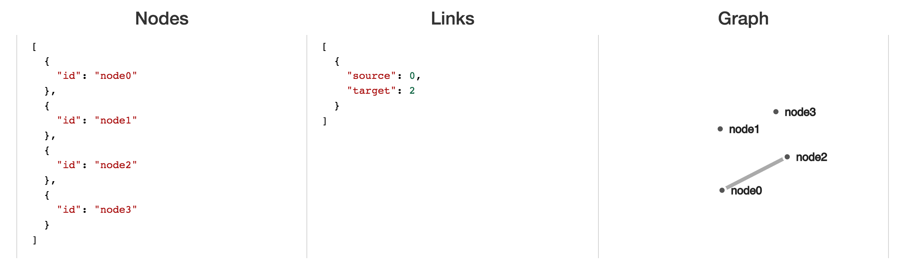

# Module 11: Networks (Force Directed Layouts)

## Overview
In this module, we'll look at D3's approach for building network visualizations. While there are many ways of visualizing networks ([adjacency matrices](https://bost.ocks.org/mike/miserables/), [hive plots](https://bost.ocks.org/mike/hive/), [dendrograms](https://bl.ocks.org/mbostock/4063570), etc.), this module focuses on methods for explicitly visualizing network graphs.

If you prefer watching entertaining videos to reading tutorials, I suggest you watch [this talk](https://www.youtube.com/watch?v=Mucmb33711A&list=PLlgxAbM67lYIQ5jid9cXsm72wEpHhAnyb&index=8) by [Jim Vallandingham](http://vallandingham.me/), which captures and explains these ideas incredibly well.
<!-- START doctoc generated TOC please keep comment here to allow auto update -->
<!-- DON'T EDIT THIS SECTION, INSTEAD RE-RUN doctoc TO UPDATE -->
**Contents**

- [Resources](#resources)
- [Network Data](#network-data)
- [High-level View](#high-level-view)

<!-- END doctoc generated TOC please keep comment here to allow auto update -->

## Resources
Here are a few resources to help you better understand network graphs:

- [Force Layout](https://github.com/mbostock/d3/wiki/Force-Layout) _(D3 Wiki)_
- [Abusing the Force](https://www.youtube.com/watch?v=Mucmb33711A&list=PLlgxAbM67lYIQ5jid9cXsm72wEpHhAnyb&index=8) _(Vallandingham, OVC Video)_
- [Bostock Explains Networks](https://vimeo.com/29458354) _(Bostock, Meetup Video)_
- [Bostock Explains Networks](http://mbostock.github.io/d3/talk/20110921/#0) _(Bostock, Meetup Video Slides)_

## Network Data
Before we talk about **visualizing** network data, we should briefly discuss the **structure** of network data. Network data captures information regarding a set of elements and the relationships between them. To use network vocabulary, we'll use the following terms:

> **Elements**: each element or observation in your dataset is represented as a symbol in your graph, frequently referred to as a **node** or a **vertex**. These symbols often appear as symbols, but may be text, images, or other representations.

> **Relationships**: Network data captures information about the relationships (or connections between) elements. Ties between elements may be directionless (i.e., two friends share a mutual connection) or directed (i.e., payment flowed from a source node to a target node). Relationships are commonly depicted as lines (paths) between nodes, and referred to as **links** or **edges**.

Below is a simple dataset that captures relationships between elements, and an example of how that data could be represented in a graph. Open up [demo-1](demo-1) to interactively edit the underlying dataset (note, the implementation is imperfect).



## Force-Directed Layout Overview
In order to understand the methods below, you must first understand _**what is actually happening**_ when D3 builds a network visualization. Unlike other layouts in which we have explicit position for underlying data values, network visualizations do not have a single solution for expressing the elements in the dataset and all of their connections. Building a network visualization is an attempt to meet certain aesthetic constraints in a rendering area, such as:

- Minimize edge crossings
- Maximize layout symmetry
- Minimize edge length variance
- Minimize longest edge
- Minimize bends towards straight lines

A common approach for computing a layout that meets these constraints is to leverage a **physical simulation** that facilitates the optimization of given requirements. The layout we'll describe is the **force-directed layout**, which applies the following behaviors in order to achieve the constraints:

>**Nodes** act as charged particles that repulse and attract one another.

>**Edges** act as geometric constraints that determine the distance between nodes

Through **iterative** physical simulation, the optimal layout of nodes is computed. In each step of the simulation, the positions of the nodes are adjusted according to a variety of physical forces (attractions / repulsions) until a threshold level of constraints is met. The important takeaway for this learning module is that **node positions are updated repeatedly** until the simulation converges.

## Force Layout Simulation
Similar to other layouts, D3 provides a method for computing force directed layouts with the `d3.layout.force` method. Not surprisingly, this is a _function that returns a function_, enabling you to specify a variety of behaviors about the simulation forces necessary to compute the layout. Here are _some of_ the parameters you will want to adjust to manipulate your layout:

- **nodes**: An `array` of objects specifying the vertices you want to represent.
- **links**: An `array` of objects specifying the edges you want to represent. Even if your data is undirected, you'll use the terms `source` and `target` the specify the node **indices** that should be connected.
- **size**: An `array` indicating the `width` and `height` of the plotting area.
- **friction**: This parameter (suggested to be in the `0 - 1` range) specifies the rate at which the velocity of each node will decline at each step in the simulation.
- **gravity**: A numeric value that sets a weak geometric constraint on the simulation by applying a spring-like force between each node and the center of the layout. This prevents nodes from escaping the layout.
- **linkDistance**: Sets the target link distance for the layout. Link distances in the simulation are compared to target distances. Defaults to `-30`.
- **charge**: A numeric value specifying the repulsion of each node. Defaults to `-30`.

- **linkStrength**: A value in the range `0 - 1` specifying the rigidity of the links .

Here is an example of declaring a force function:

```javascript
// Set force function
var force = d3.layout.force()
    .gravity(.05)
    .distance(100) // Desired distance
    .charge(-100) // Negative number indicates repulsion
    .size([width, height]) // Set width and height
    .nodes(nodes) // Pass in elements as `nodes`
    .links(links); // Pass in edges as `links`
```

Note, while many of these parameters accept single values, they **also accept functions**, allowing you to use data values of your links or nodes to drive the layout of the graph (most notably `linkDistance` and `charge`). For full descriptions of each parameter, see the [documentation](https://github.com/mbostock/d3/wiki/Force-Layout). While the code snipit above specifies the behavior of your simulation, _**it does not initiate it**_. Not surprisingly, you use the `.start()` method to initialize your simulation, which will compute your layout on the specified `nodes` and `links`.

Importantly, passing your `node` data to your `force` function **changes your data**. The following attributes are computed using the `nodes` function (from [documentation](https://github.com/mbostock/d3/wiki/Force-Layout#nodes)):

- `index` - the zero-based index of the node within the nodes array.
- `x` - the x-coordinate of the current node position.
- `y` - the y-coordinate of the current node position.
- `px` - the x-coordinate of the previous node position.
- `py` - the y-coordinate of the previous node position.
- `fixed` - a boolean indicating whether node position is locked.
- `weight` - the node weight; the number of associated links.

## Implementing the Force Layout
As noted above, the `.start` method initializes your simulation, iteratively re-positioning elements to find an optimal layout that satisfied the specified restraints. Each step in the simulation is registered as a `tick` event. In order to visually represent the progress of the simulation, you'll want to specify an event-handler that changes element position each time the `tick` event occurs. For example:

```javascript
// Select all elements with class link to perform a data-join
var link = svg.selectAll(".link")
              .data(links)

// Select all elements with class node to perform a data-join
var node = svg.selectAll(".node")
               .data(nodes, function(d) {return d.id;})

// Enter/append symbols for links (lines) and nodes (circles)
...

// On tick function for each step in the simulation
force.on("tick", function() {
  // Reset attributes for each line
  link.attr("x1", function(d) { return d.source.x; })
      .attr("y1", function(d) { return d.source.y; })
      .attr("x2", function(d) { return d.target.x; })
      .attr("y2", function(d) { return d.target.y; });

  // Reset the transform/translate property for each circle element
  node.attr("transform", function(d) { return "translate(" + d.x + "," + d.y + ")"; });
});
```

In order to begin computing your layout (and assigning the associated `x` and `y` properties to each piece of data), you'll need to initialize the simulation using the `.start` method:

```javascript
force.start() // initialize the simulation
```
