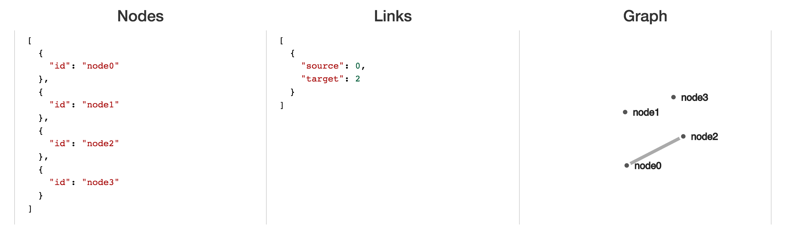

## Demo 1: Data Structures

The demo provides an interactive environment for editing the `links` and `nodes` in a force-directed layout. Once you fork/clone this repository and start running a local server, you'll have a site in which you can edit the nodes and links that looks like this:

Note, the attempt a "validating" JSON is really just a quick attempt to use the JSON object in the graph and _**is not**_ a robust test.
