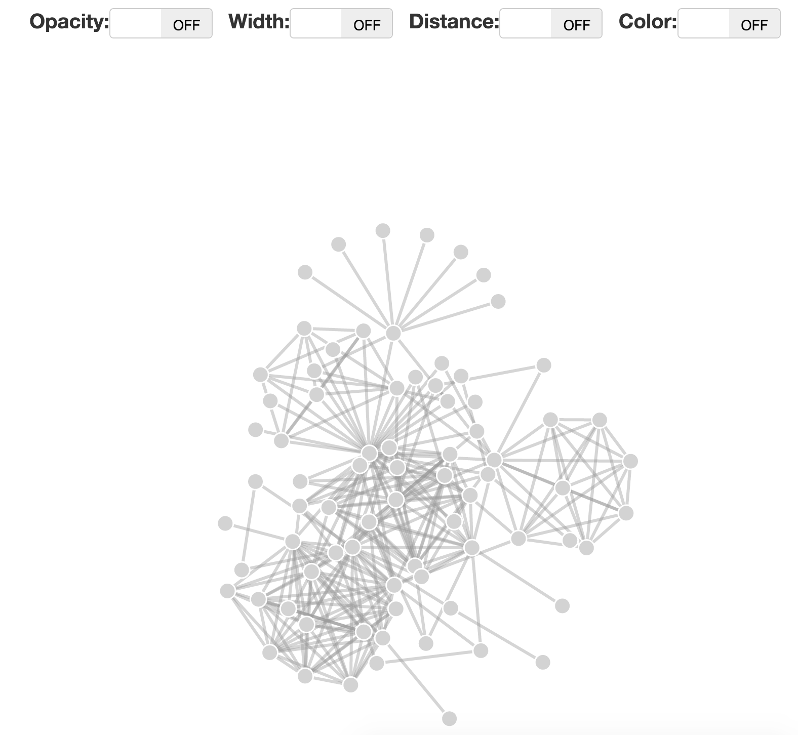

## Demo 2: Network Attributes

The demo provides a quick experiment for assigning visual attributes to network `nodes` and `links`. Once you fork/clone this repository and start running a local server, you'll have a site in which you can edit the visual attributes, that looks like this:

Note, this is not necessarily an optimal encoding of this data, rather it is a quick experiment to allow changing network parameters.
